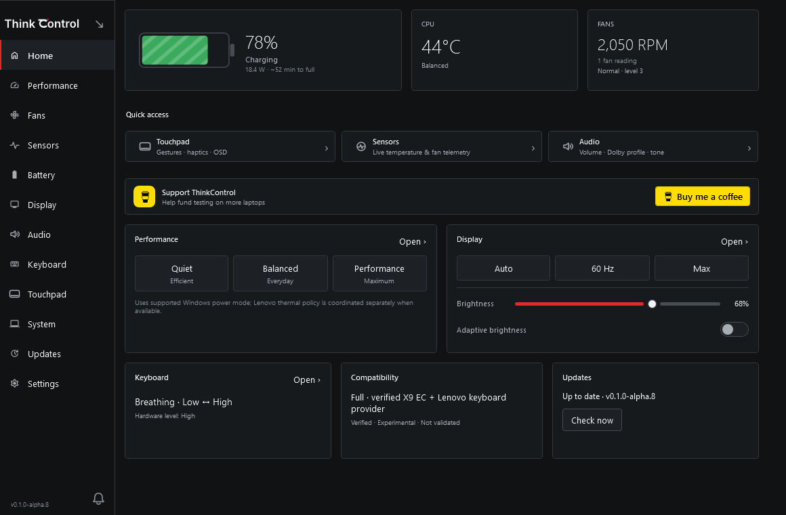
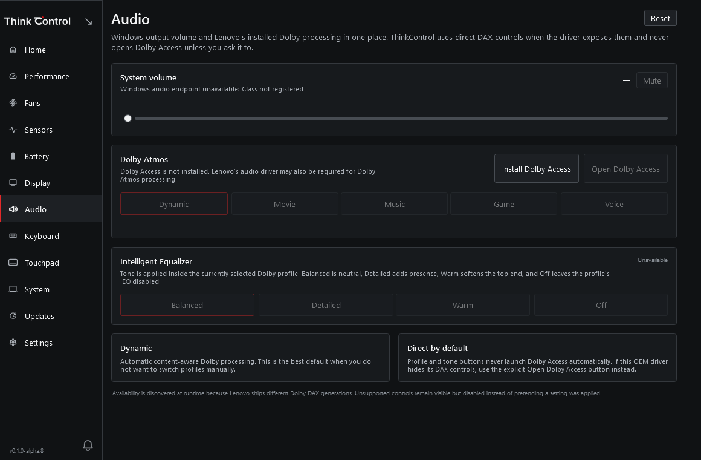
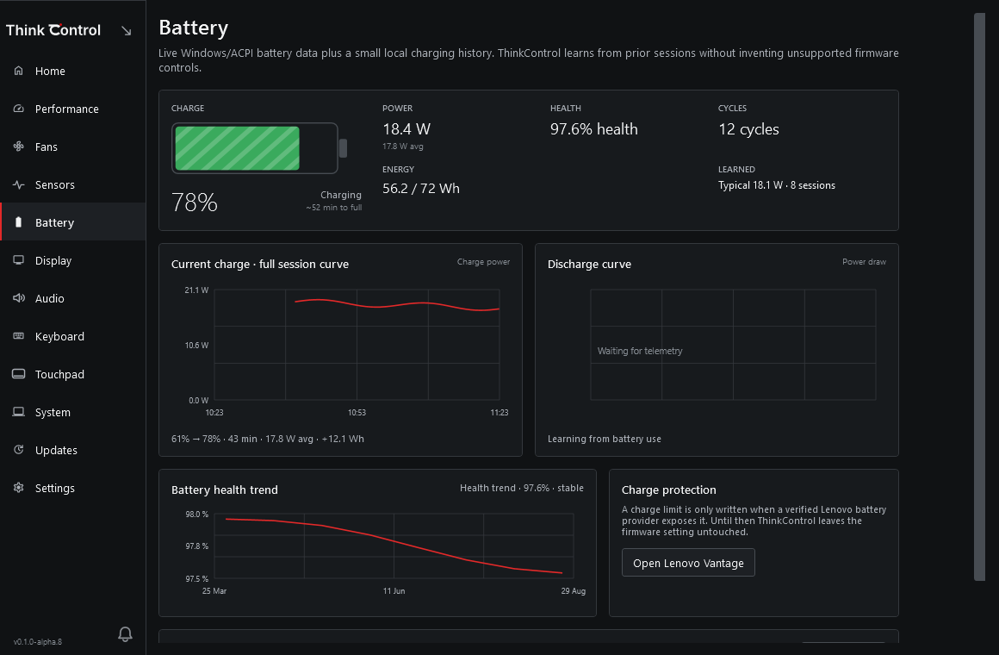

<div align="center">
  <picture>
    <source media="(prefers-color-scheme: dark)" srcset="assets/brand/v3/wordmark/ThinkControl_wordmark_dark.svg">
    <source media="(prefers-color-scheme: light)" srcset="assets/brand/v3/wordmark/ThinkControl_wordmark_light.svg">
    
  </picture>

  <p><strong>A compact Windows laptop-control app for power, cooling, sensors, display, audio, keyboard, touchpad and battery telemetry.</strong></p>

  [](https://github.com/Hugowhitee/ThinkControl/actions/workflows/ci.yml)
  [](https://github.com/Hugowhitee/ThinkControl/releases)
  [](https://github.com/Hugowhitee/ThinkControl/releases)
  [](LICENSE)

  **[Download](https://github.com/Hugowhitee/ThinkControl/releases)** ·
  **[Device support](docs/DEVICE-SUPPORT.md)** ·
  **[Documentation](docs/README.md)** ·
  **[Report a bug](https://github.com/Hugowhitee/ThinkControl/issues/new?template=bug-report.yml)**

  <br><br>
  <a href="https://buymeacoffee.com/hugowhite">
    
  </a>
</div>

## What is ThinkControl?

ThinkControl is a lightweight Windows 11 companion for laptop settings that are normally spread across Windows Settings, manufacturer utilities and separate monitoring tools. It provides a small notification-area popup for everyday changes and an Advanced window for deeper controls and telemetry.

The project is currently an **alpha**. Windows-owned features are kept broadly compatible, while low-level hardware controls are only enabled after ThinkControl verifies that the required provider is available and safe to use.

**Current prerelease:** `v0.1.0-alpha.9`  
**Primary verified reference device:** ThinkPad X9-15 Gen 1 (`21Q6` / `21Q7`)  
**Platform:** Windows 11 x64 · .NET 10

## Download and install

Download the latest prerelease from **[GitHub Releases](https://github.com/Hugowhitee/ThinkControl/releases)** and run:

```text
ThinkControl-Setup-0.1.0-alpha.9.exe
```

The setup bootstrapper is intentionally small. It downloads the matching application payload, verifies its SHA-256 checksum and installs the ThinkControl UI plus the hardware service.

If ThinkControl is already installed, setup switches to update mode automatically. It can close the running app, update the hardware service and relaunch ThinkControl when installation finishes.

## Interface

ThinkControl has two surfaces:

- **Compact** — quick controls from the Windows notification area.
- **Advanced** — full pages for telemetry, configuration and hardware setup.

The screenshots below are generated by the same WPF renderer used in CI.

<p align="center">
  
  &nbsp;
  
</p>

<p align="center">
  
  
  
</p>

Pages return to the top when reopened, layouts adapt to narrower windows, sliders use larger drag targets, and hover/selection states follow one shared ThinkControl interaction style.

## Features

| Area | What ThinkControl provides |
| --- | --- |
| **Home** | Battery, CPU and fan overview plus quick access to commonly used controls and notifications |
| **Performance** | Quiet, Balanced and Performance preferences with separate battery/AC behavior |
| **Fans** | Lenovo Auto, verified manual levels and supervised cooling profiles where a writable provider is supported |
| **Sensors** | CPU, GPU, storage, memory, battery, fan and other telemetry from trustworthy detected providers |
| **Battery** | Watts, Wh, health, filtered ETA, charge/discharge sessions, drain rate and session graphs |
| **Display** | Brightness, adaptive brightness, refresh rate and automatic 60 Hz / maximum switching |
| **Audio** | Windows system volume plus direct Dolby profile and Intelligent Equalizer controls when DAX exposes them |
| **Keyboard** | Hardware brightness plus Auto, Breathing, Reactive and experimental Audio effects where Lenovo control is available |
| **Touchpad** | Live touch position/trail, configurable edge gestures, haptics and themed gesture pop-ups |
| **Updates** | Automatic checks, Last checked time, verified in-app download and one-click installer handoff |

ThinkControl does **not** invent missing RPM values, fake PWM percentages, guessed EC registers or synthetic sensor readings. A control stays unavailable until its provider is actually detected and validated.

## Touchpad gestures

The Touchpad page visualizes the real contact position with a red point and fading trail. Edge areas brighten on hover and only become red when selected.

Default edge actions:

| Edge | Action |
| --- | --- |
| Left | Volume |
| Right | Brightness |
| Top | Media seek |
| Bottom | Off |

Other actions include previous/next track, play/pause, mute, Task View, Show Desktop, keyboard backlight and performance mode.

Media seek is velocity-aware and coalesces updates instead of sending a seek request for every input frame. Slow movement stays precise; fast movement travels further. This is designed to avoid the overlapping seek requests that can make players such as Spotify jump or continue seeking after a gesture ends.

During a gesture the UI can show values such as `Volume · 58% · +5%`, `Brightness · 72% · −3%` or `Media seek · +18.4 s`. Individual sliders show their current value and difference from default and expose a small reset icon when changed.

Haptic feedback uses discrete levels instead of misleading percentages, and click sensitivity is presented in the intuitive direction **Light → Medium → Firm**.

## Audio and Dolby

The Audio page includes a live Windows system-volume slider, mute state and active output information.

When the installed Dolby DAX backend exposes direct control, ThinkControl can switch between **Dynamic, Movie, Music, Game and Voice** without opening Dolby Access. Intelligent Equalizer choices use the Dolby/Lenovo-style **Balanced, Detailed, Warm and Off** tones for the selected profile.

If direct DAX control is unavailable, ThinkControl reports that state instead of pretending the change succeeded. Dolby Access opens only when explicitly requested.

## Battery history

Charge and discharge sessions are stored locally using compact samples. A session can show:

- start and end percentage
- duration
- Wh added or consumed
- average and peak power
- percentage per hour
- a time graph

Recent discharge history is used as a bounded input to smooth the remaining-battery estimate. Live telemetry still has priority, so old workloads do not permanently distort the ETA.

## Hardware support and recovery

ThinkControl separates normal Windows controls from privileged hardware access. Low-level operations run through `ThinkControl.Service` using semantic named-pipe commands rather than arbitrary EC/IOCTL passthrough.

Hardware Setup checks these layers independently:

1. **ThinkControl hardware service** — privileged service state and repair.
2. **Sensor / PawnIO access** — read-only LibreHardwareMonitor and EC/sensor discovery.
3. **Lenovo platform integration** — Lenovo keyboard and platform-driver/provider availability.

If a required component is missing, ThinkControl keeps the relevant controls visible but explains what is unavailable and links to the recovery action instead of leaving the feature permanently disabled without explanation.

### ThinkPad X9-15 Gen 1

The X9-15 Gen 1 (`21Q6` / `21Q7`) is the current verified low-level reference profile.

| Capability | Current approach |
| --- | --- |
| Sensors | Windows/platform inventory + LibreHardwareMonitor/PawnIO discovery |
| Fan RPM | Trustworthy discovered telemetry, including X9 EC tachometer where available |
| Fan control | Lenovo Auto + reviewed X9 discrete fan levels with readback and safety fallback |
| Cooling profiles | Silent, Normal and Cool with smoothing/hysteresis on a verified writable provider |
| Keyboard | Lenovo PM/EnergyDrv/provider contracts with readback |
| Touchpad | Windows Precision Touchpad input with X9 geometry fallback when physical HID units are absent |
| Dolby | Direct DAX profile/tone control when the installed driver exposes it |

See [Device support](docs/DEVICE-SUPPORT.md), [Lenovo providers](docs/LENOVO-PROVIDERS.md) and [X9-15 research](docs/research/x9-15-gen1.md) for the technical details.

## Help improve device support

On unverified laptops, ThinkControl can prepare a **hardware-only device report**. The flow is shown as:

`Detect → Compare → New data → Review → Share`

Sharing only becomes useful after ThinkControl has found new provider or capability information. The report is reviewed before sharing and excludes serial numbers, Windows usernames, hostnames, personal paths and raw personal logs. Nothing is silently uploaded.

## Updates

ThinkControl checks GitHub Releases shortly after startup and then periodically. Background checks **never open UAC and never install by themselves**.

When an update is available, the Updates page shows a persistent **Last checked** time. Clicking **Install update** performs the complete handoff inside the app:

`Downloading → Verifying → Approve Windows prompt → Installing → Relaunch`

Both the setup executable and application payload are downloaded before elevation and verified against `SHA256SUMS.txt`. If the Windows administrator prompt is cancelled or setup fails, ThinkControl stays usable and does not automatically re-launch the installer on the next startup.

## Reset and Windows Settings links

Changed sliders expose a compact reset-to-default icon. Pages can reset their own settings, while the global **Reset all** action is separated in Settings and requires confirmation.

For settings that are also owned by Windows, ThinkControl provides a subtle **Open Windows settings** shortcut where it is useful rather than duplicating native settings everywhere.

## Tray and notifications

ThinkControl is single-instance: launching it again activates the existing process instead of creating another notification-area icon.

A left click on the tray icon toggles Compact open and closed. Desktop/start-menu launches restore the normal taskbar window. Hardware and update attention items appear in the shared notification inbox first; opening a notification then takes the user to the relevant recovery or configuration page.

## Safety and privacy

- No arbitrary low-level hardware write interface is exposed to the UI.
- Unknown fan writes remain blocked.
- Manual fan ownership returns to Lenovo Auto when the controller/service is disposed where supported.
- Missing hardware values remain unavailable rather than being guessed.
- Device-support diagnostics are redacted and opt-in.

See [Hardware safety](docs/HARDWARE-SAFETY.md) and [Diagnostics & privacy](docs/DIAGNOSTICS.md).

## Development

Windows CI builds the solution, runs Core tests and renders the WPF visual-QA matrix. Packaging CI publishes UI/service payloads, builds the web bootstrapper and performs a real silent **install → service Running → uninstall → cleanup** lifecycle test.

```powershell
dotnet restore ThinkControl.slnx
dotnet build ThinkControl.slnx -c Release
.\tools\visual-qa.ps1
```

Automated CI cannot prove physical-device behavior. Fan ownership, RPM, Lenovo keyboard readback, touchpad HID behavior, Dolby DAX behavior and haptic response still require real hardware testing.

### Documentation

- [Documentation index](docs/README.md)
- [Product specification](docs/PRODUCT.md)
- [Architecture](docs/ARCHITECTURE.md)
- [Device support](docs/DEVICE-SUPPORT.md)
- [Cooling design](docs/COOLING-DESIGN.md)
- [Hardware safety](docs/HARDWARE-SAFETY.md)
- [Lenovo providers](docs/LENOVO-PROVIDERS.md)
- [Dependencies](docs/DEPENDENCIES.md)
- [Diagnostics and privacy](docs/DIAGNOSTICS.md)
- [Design system](docs/DESIGN.md)
