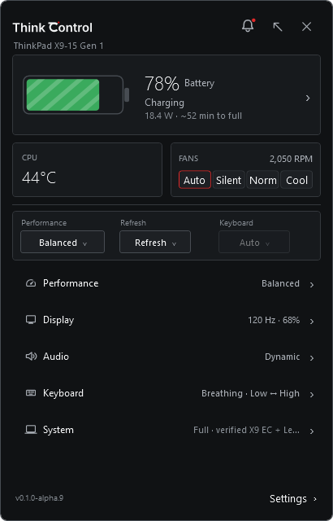
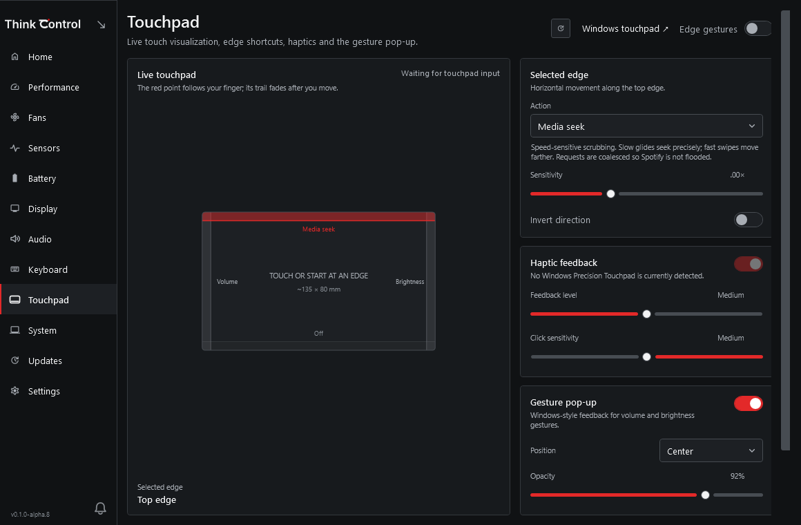
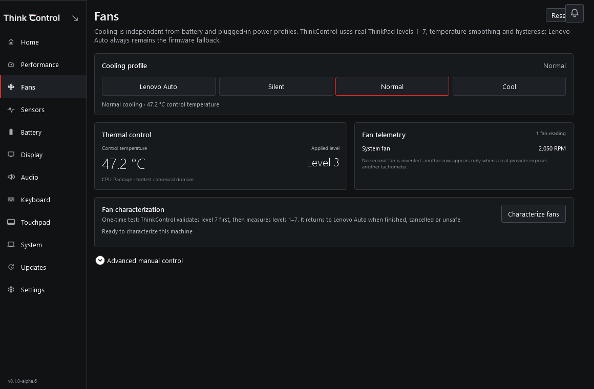

<div align="center">
  <picture>
    <source media="(prefers-color-scheme: dark)" srcset="assets/brand/v3/wordmark/ThinkControl_wordmark_dark.svg">
    <source media="(prefers-color-scheme: light)" srcset="assets/brand/v3/wordmark/ThinkControl_wordmark_light.svg">
    
  </picture>

  <p>Clean Windows controls, hardware telemetry and laptop tuning from one tray app.</p>

  [](https://github.com/Hugowhitee/ThinkControl/actions/workflows/ci.yml)
  [](https://github.com/Hugowhitee/ThinkControl/releases)
  [](https://github.com/Hugowhitee/ThinkControl/releases)
  [](LICENSE)

  **[Download](https://github.com/Hugowhitee/ThinkControl/releases)** |
  **[Device support](docs/DEVICE-SUPPORT.md)** |
  **[Documentation](docs/README.md)** |
  **[Report a bug](https://github.com/Hugowhitee/ThinkControl/issues/new?template=bug-report.yml)**
</div>

## Current prerelease

ThinkControl `v0.1.0-alpha.5` is the current prerelease. The ThinkPad X9-15 Gen 1 machine types `21Q6` and `21Q7` remain the physically verified low-level reference profile. Other laptops use capability discovery: Windows features stay available, read-only hardware providers are detected independently, and unknown EC/PWM writes remain locked until a device profile is physically verified.

ThinkControl currently targets Windows 11 x64 and .NET 10.

## Interface

ThinkControl has two connected surfaces: a compact notification-area flyout for everyday controls and a resizable Advanced window for detailed tuning and telemetry. These previews are generated by the same WPF snapshot renderer used in release validation.

<p align="center">
  
  &nbsp;&nbsp;
  
</p>

<p align="center">
  
</p>

The UI uses the same ThinkControl theme resources across pages, menus and gesture pop-ups. Navigation, buttons, segments and switches share subtle global press/hover motion rather than page-specific animation hacks.

## Highlights

| Area | Current support |
| --- | --- |
| Power | Separate Battery and Plugged-in Efficiency, Balanced and Performance preferences |
| Cooling | Lenovo Auto plus supervised Silent, Normal and Cool curves on verified writable providers |
| Fans | Real RPM from available firmware/Windows/LibreHardwareMonitor/PawnIO providers; no invented second fan |
| Sensors | Read-only CPU, GPU, storage, memory, battery, fan and other telemetry exposed by detected providers |
| Display | Refresh rate, Auto refresh, brightness and adaptive brightness through supported Windows APIs |
| Keyboard | Off, Low, High plus Auto, Breathing, Reactive and experimental Audio policies when a Lenovo provider passes read/readback checks |
| Audio | Dolby Dynamic, Movie, Music, Game and Voice; direct DAX switching when exposed, safe Dolby Access fallback for main profiles, direct Game subprofiles where supported |
| Touchpad | Live red contact visualization + fading trail, configurable edge zones and speed-aware actions |
| Haptics | Windows-style discrete feedback levels and click sensitivity when the Precision Touchpad exposes them |
| Battery | Percentage, watts, Wh, filtered ETA, cycle count, local history and health trend where Windows reports it |
| Updates | Automatic release checks, SHA-256 verified download and in-place installer update |
| Hardware setup | Service repair, optional verified PawnIO installation, Lenovo driver guidance and capability re-detection |

ThinkControl deliberately does **not** substitute fake PWM percentages, invented sensors, guessed fan registers or synthetic wattage targets for unavailable hardware data.

## Touchpad

The Touchpad page receives live Windows Precision Touchpad Raw HID frames even when edge gestures are disabled. A red point follows the real contact position and a short trail makes movement easy to understand while configuring zones.

The default preset is:

| Edge | Default action |
| --- | --- |
| Left | Volume |
| Right | Brightness |
| Top | Media seek |
| Bottom | Off |

Available actions include volume, brightness, speed-aware media seek, previous/next track, play/pause, mute, Task View, Show Desktop, keyboard backlight and performance mode.

Media seek is coalesced instead of sending a playback-position request for every touch frame. Slow movement stays precise; velocity progressively increases seek distance on a fast or long swipe.

The gesture OSD is a ThinkControl-themed interactive control rather than a passive notification: volume can be muted from the icon and volume/brightness can be adjusted from its slider. It follows the current app theme, uses configurable light transparency and can be placed left, center or right above the Windows work area so it never comes from behind the taskbar.

Haptic feedback uses discrete Windows-like levels instead of a misleading free percentage slider:

- Feedback: Off, Low, Medium, High, Strong
- Click sensitivity: Firm, Medium, Light

## Hardware compatibility and setup

The normal UI runs as the signed-in user. Privileged operations are isolated in `ThinkControl.Service` and exposed through semantic named-pipe commands rather than arbitrary EC/IOCTL passthrough.

Provider discovery is intentionally separated:

- Windows display, power and battery features are device-neutral.
- LibreHardwareMonitor/PawnIO sensor discovery is read-only and can work even when fan writes are unavailable.
- Fan RPM can come from any trustworthy discovered telemetry provider.
- Lenovo keyboard control activates only after a provider probe succeeds and write operations can be checked/read back.
- Direct EC fan writes stay restricted to reviewed device profiles. The X9 `21Q6/21Q7` profile is currently the verified reference.

If something is missing, ThinkControl no longer ends at a generic disabled control. Compact shows a small hardware-attention indicator; opening it takes you to Advanced + Hardware Setup. Hardware Setup can repair the ThinkControl service, download the pinned PawnIO installer with SHA-256 verification when additional sensor access is useful, open Lenovo Vantage for platform-driver maintenance, and retry detection without reinstalling the app.

For an unverified laptop, ThinkControl can generate a **hardware-only device support report** for GitHub. It includes model/capability/provider summaries but intentionally excludes serial numbers, Windows usernames, hostnames, personal paths and raw logs. Nothing is uploaded automatically: the app opens a pre-filled GitHub issue that the user can review before submission. This lets future device profiles be built from real capability evidence without experimenting with unknown write registers on users' machines.

See [Device support](docs/DEVICE-SUPPORT.md), [Cooling design](docs/COOLING-DESIGN.md) and [Hardware safety](docs/HARDWARE-SAFETY.md).

## ThinkPad X9-15 Gen 1

The verified X9 reference profile currently includes:

| Capability | Implementation |
| --- | --- |
| Power | Windows Efficiency, Balanced and Performance preferences stored independently for battery and AC |
| Lenovo thermal policy | X9 Lenovo Intelligent Thermal Solution coordination when available |
| Sensors | LibreHardwareMonitor/platform inventory with PawnIO recovery when required |
| Fan RPM | X9 EC tachometer plus read-only Lenovo/Windows/LHM fan discovery when available |
| Fan state | Verified X9 EC control register |
| Lenovo Auto | Firmware ownership with readback |
| Custom cooling | Silent, Normal and Cool using discrete ThinkPad levels 1–7, smoothing, hysteresis and safety handoff |
| Manual fan control | Advanced discrete levels 1–7 |
| Keyboard | Lenovo driver/provider contracts with readback and Lenovo Vantage maintenance fallback |
| Touchpad | Precision Touchpad live visualization, edge gestures and X9 geometry fallback when HID physical units are missing |
| Haptics | Windows/HID capability discovery with discrete feedback and click-sensitivity controls |
| Dolby | Direct DAX profile/subprofile control when exposed by the installed driver; safe fallback for main profiles |

Normal service/controller disposal attempts to return an active ThinkControl fan override to Lenovo Auto before low-level access is closed.

Technical findings are recorded in [X9-15 Gen 1 research](docs/research/x9-15-gen1.md).

## Dolby audio

ThinkControl exposes the Lenovo/Dolby profile names Dynamic, Movie, Music, Game and Voice. It first probes the registered Dolby DAX backend. If that driver exposes direct profile methods, ThinkControl changes the profile without opening Dolby Access and verifies readable state where possible.

Game subprofiles — FPS, Racing, RTS and RPG — are only enabled when the direct DAX backend exposes subprofile control. ThinkControl does not guess a hidden numeric profile mapping or edit Dolby LocalState files. If direct main-profile control is unavailable but Dolby Access is installed, the main profile can use the safe UI Automation fallback.

## Updates and installer

ThinkControl checks GitHub Releases automatically. A new release is downloaded to a temporary location, its installer is checked against `SHA256SUMS.txt`, and the verified setup is started in update mode. The updater no longer sends the user to the release web page for the normal update path.

The installer detects an existing ThinkControl installation, switches to update wording, skips first-install shortcut choices, closes a running tray/UI instance before replacing files, stops/re-registers the hardware service safely, and can relaunch ThinkControl after a silent in-app update.

The setup itself stays small: the release uses a web bootstrap installer with an externally verified application payload.

Download from [Releases](https://github.com/Hugowhitee/ThinkControl/releases):

```text
ThinkControl-Setup-0.1.0-alpha.5.exe
ThinkControl-Payload-0.1.0-alpha.5.zip
SHA256SUMS.txt
```

## Reset and UI behavior

Relevant Advanced pages have a local Reset action, including Performance, Fans, Display, Keyboard, Touchpad and Audio. Settings also provides **Reset all** for ThinkControl-owned preferences and supported controls while deliberately retaining non-portable Windows/OEM state such as current display brightness and privacy/diagnostics choice.

Every page scrolls back to the top when it is opened. Adaptive-brightness switch rows reserve enough height to avoid clipping. Audio and Sensors navigation icons receive the same selected bold/weight treatment as the other navigation items.

Compact includes themed quick dropdown controls for Performance, Refresh and Keyboard. The notification-area icon is single-instance: launching ThinkControl again activates the existing process instead of creating another tray icon, and clicking the tray icon again closes the currently open ThinkControl surface.

## Build and validation

The repository targets .NET 10 and WPF. Windows CI restores, builds, runs Core tests and renders real WPF snapshots at fixed Compact and Advanced sizes. Packaging CI builds the framework-dependent UI/service payload, verifies branding, creates the web bootstrapper and performs an actual silent install → service-running → uninstall lifecycle test.

```powershell
dotnet restore ThinkControl.slnx
dotnet build ThinkControl.slnx -c Release
.\tools\visual-qa.ps1
```

Automated CI cannot prove physical laptop behavior. RPM, EC fan ownership, keyboard readback, touchpad HID reports, Dolby DAX behavior and haptic response still require real-device verification; ThinkControl reports those states instead of pretending CI validated them.

## Documentation

- [Documentation index](docs/README.md)
- [Device support](docs/DEVICE-SUPPORT.md)
- [Product specification](docs/PRODUCT.md)
- [Architecture](docs/ARCHITECTURE.md)
- [Cooling design](docs/COOLING-DESIGN.md)
- [Hardware safety](docs/HARDWARE-SAFETY.md)
- [Lenovo providers](docs/LENOVO-PROVIDERS.md)
- [Dependencies](docs/DEPENDENCIES.md)
- [Diagnostics and privacy](docs/DIAGNOSTICS.md)
- [Design system](docs/DESIGN.md)
- [Visual QA](docs/VISUAL-QA.md)
- [Alpha testing](docs/ALPHA-TESTING.md)
- [Release checklist](docs/RELEASE-CHECKLIST.md)

## License

ThinkControl is currently **source-available, not open-source**. The [ThinkControl Source-Available License](LICENSE) permits personal non-commercial use, inspection and private modification, but does not permit public forks/mirrors, redistribution, resale, commercial exploitation or public derivative builds without written permission.

The official public source/binary channel is the repository controlled by the ThinkControl copyright holder. Third-party components retain their own licenses; see [THIRD_PARTY_NOTICES.md](THIRD_PARTY_NOTICES.md).

ThinkControl is an independent project and is not affiliated with or endorsed by Lenovo, Dolby or Microsoft.

